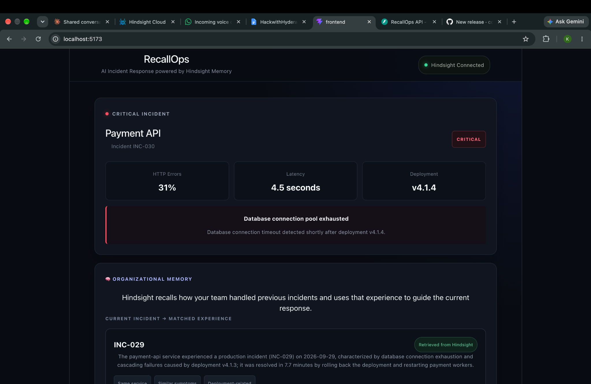
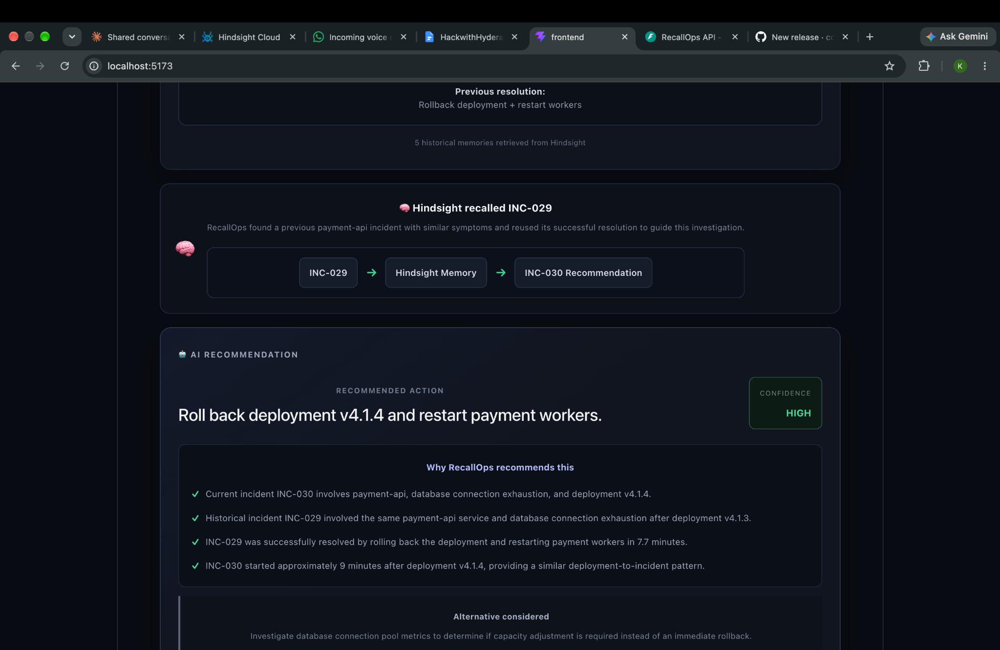
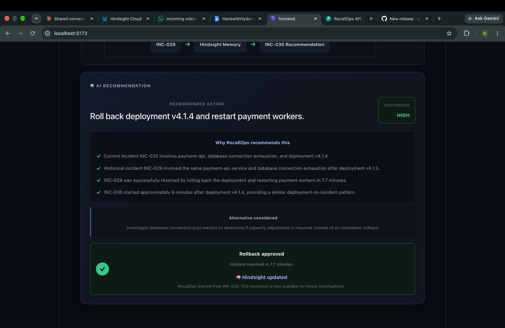

# RecallOps

> AI Incident Response with Hindsight Memory

RecallOps is an AI-powered incident-response agent that helps engineers investigate production incidents by remembering how similar incidents were handled in the past.

Instead of treating every incident as a completely new problem, RecallOps retrieves relevant organizational memory from previous incidents, reasons over that history, recommends an action, and stores the outcome for future investigations.

---

## The Problem

Production incidents often repeat familiar failure patterns.

An engineer may have previously solved a similar incident, but that experience can be buried in old incident reports, tickets, chat messages, or runbooks.

Traditional AI assistants can analyze the current incident, but without persistent organizational memory they may not know how the organization handled a similar problem before.

RecallOps addresses this by making organizational memory part of the incident-response workflow.

---

## The Solution

RecallOps follows a simple human-in-the-loop workflow:

```text
Production Incident
        ↓
Recall historical experience
        ↓
Reason using incident + memory
        ↓
Generate recommendation
        ↓
Engineer reviews and approves
        ↓
Incident resolved
        ↓
Store resolution in Hindsight
        ↓
Future incidents can reuse the experience
## 🎬 Demo

RecallOps demonstrates how persistent organizational memory improves
production incident investigation.

### 1. New Production Incident

A new critical incident occurs in `payment-api`.



### 2. Hindsight Recalls Previous Experience

RecallOps retrieves a relevant historical incident from Hindsight.

The agent connects the current incident to a previous `payment-api`
incident with similar symptoms and a deployment-related failure.



### 3. Recommendation and Learning

Using the retrieved organizational memory, RecallOps recommends a
resolution while keeping the engineer in control.

After the engineer approves and resolves the incident, the outcome is
stored in Hindsight so it can be used during future investigations.



### The Memory Loop

```text
New Incident
     ↓
Hindsight Recall
     ↓
Relevant Past Experience
     ↓
AI Recommendation
     ↓
Engineer Decision
     ↓
Resolution
     ↓
Hindsight Learns
     ↓
Better Future Investigations